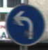
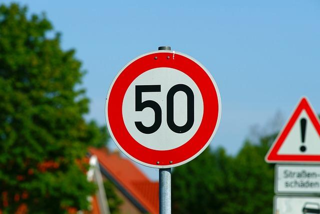

# Autonomy-2024Spring-FP
Hello everyone! This is Jack from GIEE and Tiana from ESOE. In the final project, we are determined to go beyond theory survey and actually make a movable car. Although we didn't make what we expect at the end, it's still our honor to present the work here. 

##    Environment setting
First clone our project to your PC.
```git clone https://github.com/jackmafan/Autonomy-2024Spring-FP.git```

Then change to the main directory, setting the environment by running the following commands. Make sure you have installed anaconda in advance.
```
conda create --name ItA24_FP python=3.9 -y
conda activate ItA24_FP
pip install -r requirements.txt
```
##    Dataset Prepararion
###    GTSRB
The German Traffic Sign Recognition Benchmark (GTSRB) is a widely used dataset in the field of computer vision and machine learning, specifically for traffic sign recognition tasks. It was introduced as part of a competition at the International Joint Conference on Neural Networks (IJCNN) in 2011 to advance the development and benchmarking of traffic sign recognition algorithms.

<div align=center>
  

<div align=left>
  
You can download the dataset through https://benchmark.ini.rub.de/ .
  
After unzip the folder, please put the data under ```GTSRB/``` like the following structures.
```
GTSRB
├───00000
├───00001
...
...
└───00042
```
    
###    CityScapes
The Cityscapes Dataset focuses on semantic understanding of urban street scenes. There are more than 5,000 fine and 20,000 coarse annotated images with fine annotations  more than 50 cities. You can download the dataset through [this link](https://www.cityscapes-dataset.com/) after registration.
<div align=center>
    


<div align=left>
  
Since the images files in folder```CityScapes/``` are just for generating negative samples, you can any negative samples(at least 2048p X 1024p) without traffic signs in ```CityScapes/```, too. Our code could traverse the entire folder.

##  Evaluation and Demo
In ```eval.py```, we provide 3 functions: ```testTSR```, ```testLD```, and```evalModel``` to test our implentation. 
    
    
To test ```testTSR``` or ```testLD```, please append arguments ```--testTSR``` or ```--testLD``` after ```python3 eval.py```. Furthermore, remember to specify the paths of tested images end with ```.jpg``` in the list when calling them. The result will be saved in folder ```demo/```
```python=
#...
if args.testTSR:
    testTSR([$PATHS_OF_YOUR_IMAGES])
if args.testLD:
    testLD([$PATHS_OF_YOUR_IMAGES])
#...
       
```

Function ```evalModel``` can test only the classifier itself over **GTSRB** dataset. Argument```--noROI``` uses the entire image rather than image, while ```--testAll``` runs evaluation over entire dataset rather than only validation set. You should name your model weight as ```model_best.pt``` under folder```checkpoints/```.

<div align=center>
  


---





---



<div align=left>

